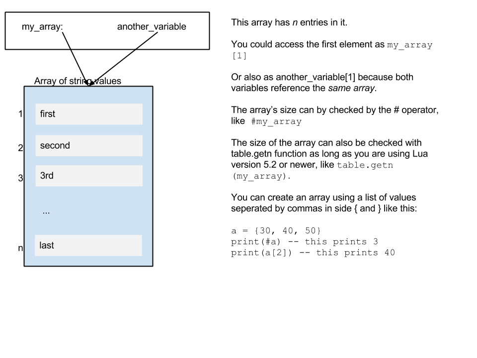

Data Types
==========

Computer programming languages work with different types of data, and have
different techniques for encoding different types of values as binary data.

Boolean
-------

Boolean values represent a truth value, with two possible states. A single bit of information
in a computer can hold one or two values.  Values in Boolean can be thought of as either
true or false or 1 or 0.

Integer
-------

Integer data types hold numeric values with no fractional part. In other words, they cannot
contain anything to the right of the decimal place.  They are like integers in algebra.
They can contain whole (natural) numbers, zero, or negative numbers.

Computers can also work with unsigned integers that do not allow numbers less than zero,
aka negative numbers.

The range of numbers an integer variable can hold depends on its storage size.  Modern
computers can typically use 32-bit or 64-bit integers.   When using unsigned integers, the
highest possible value will be bigger than with a signed integer of the same size because
1 bit of a signed integer must be used for denoting the sign for negative numbers though
the actual technique used, two's complement, is not exactly equivalent to just using the
bit's value to encode the sign.

Small integer values, typically 8 bits, are also used to handle character data, or
otherwise manipulate data stored in memory that is addressed as some number of bytes.

### Range of 16-bit Integer Values

* Signed: From −32,768 to 32,767, from −(2^15) to 2^15 − 1
* Unsigned: From 0 to 65,535 which is 2^16 − 1

### Range of 32-bit Integer Values

* Signed: From −2,147,483,648 to 2,147,483,647, from −(2^31) to 2^31 − 1
* Unsigned: From 0 to 4,294,967,295 which is 2^32 − 1

### Range of 64-bit Integer Values

* Signed: From −9,223,372,036,854,775,808 to 9,223,372,036,854,775,807, from −(2^63) to 2^63 − 1
* Unsigned: From 0 to 18,446,744,073,709,551,615 which is 2^64 − 1

Floating Point
--------------
<!--
TODO: Put in a diagram of floating point numbers.
TODO: put in some floating point examples
-->

Floating point numbers can represent very small or very large values as well as values
containing a fractional part, meaning to the right of the decimal place.

Floating point arithmetic is approximate because there are only so many bits available
for encoding values.  Floating point numbers are encoded using three parts:

* sign: This indicates if the number is positive or negative.
* mantissa: this is the "main" part of the number, also called the significand
* exponent: this indicates what exponent the mantissa is raised to for the actual value.

The actual value of a floating point number is the mantissa times the base
(which is 2 since it is binary) raised the the exponent.

Floating point numbers work similar to scientific notation when writing decimal numbers,
but the exponent is a binary number just like the mantissa or base.

Floating point numbers can contain a larger number of values, but when you perform
long sequences of operations on them they can accumulate significant errors due to
rounding.  It is also problematic to compare floating point numbers exactly. To get
useful results you typically need to check if the difference of the two numbers being
compared is below some small cutoff value instead.

The exact specification for implementing floating point in modern computers is (usually)
based on the [IEEE 754](https://en.wikipedia.org/wiki/IEEE_floating_point) standard.

The most common sizes of floating points supported are:

* single precision: represented in 32 bits with 24 bits for the mantissa
* double precision: represented in 64 bits with 53 bits of precision for the mantissa

Strings
-------
<!-- TODO: give some examples of using strings -->

Strings represent sequences of character data that represent text or other data.

Data Structures
---------------

A data structure is a way to build a complicated set of data out of small, individual data values.
For example, a list of numbers would be stored in a data structure, as opposed to a single number.  
Besides sequential lists, data structures can also represent other structures or relationships between items.  
For example, you can have specific fields with names or indexes which represent different aspects.  An example of this would be a data structure to store contact information about someone which had separate fields for name, phone number, email, and address.  You can build ever more complicated data structures by nesting them or connecting them together in different ways.  You could create a list of your contact data structures.

Programmers use lots of different kinds of data structures, but there are only a few they use very
frequently.

Arrays
------

The simplest data structure to explain is an array.  An array is basically a list of values, which are indexed
by their position.  In some computer languages the first element is at position 0, while in others it is at position 1.

